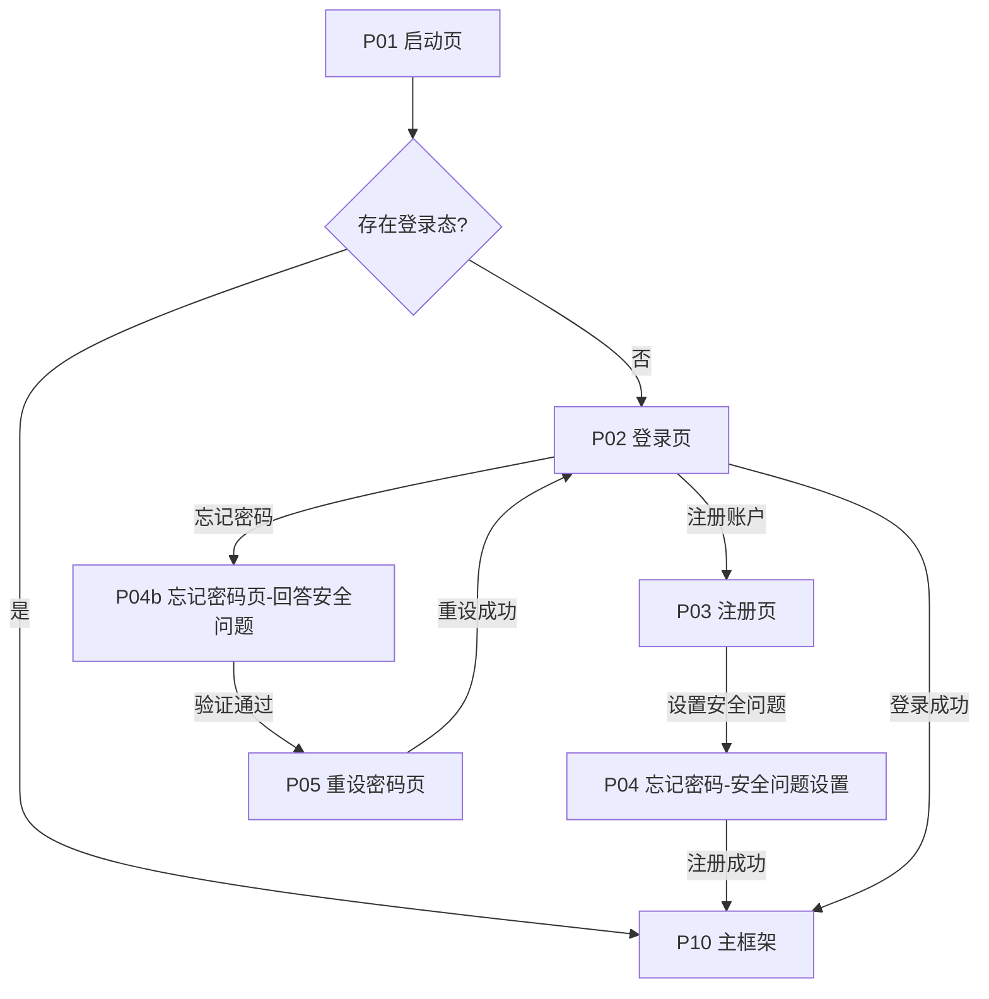
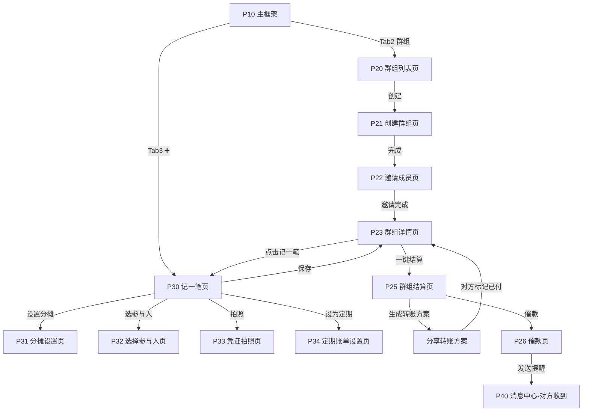
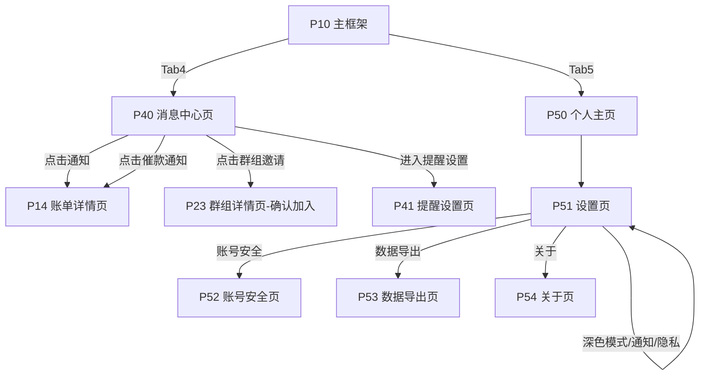

# AA分账App — 产品原型（完整页面流程）

> 版本：v1.0（功能确认版）
> 登录方式：**自定义账户名 + 密码**（不绑定手机号/微信）
> 范围：核心功能全量

---

## 目录

1. [产品概述](#1-产品概述)
2. [信息架构（页面地图）](#2-信息架构页面地图)
3. [全局导航与交互规范](#3-全局导航与交互规范)
4. [页面清单总表](#4-页面清单总表)
5. [页面流程图](#5-页面流程图)
6. [逐页原型说明](#6-逐页原型说明)
7. [关键用户流程走查](#7-关键用户流程走查)
8. [核心数据字段定义](#8-核心数据字段定义)
9. [待确认问题](#9-待确认问题)

---

## 1. 产品概述

**一句话定位**：和朋友吃饭、旅行、合租时，一人先垫付，大家AA摊钱——本App负责"记清楚、算明白、催到位"。

**核心原则**：

- **记一笔不超过30秒**：默认规则（群组全员均摊、付款人=自己）让常用场景一步完成
- **自动算清楚**：一键生成"最少转账次数"的结算方案，谁转谁、多少钱一目了然
- **从不经手资金**：只记账和提醒，钱走微信/支付宝，无合规风险
- **账户名即身份**：自定义账户名+密码，无需手机号，隐私友好

**三大实体**：`用户（账户）` → `群组` → `账单`

---

## 2. 信息架构（页面地图）

```
AA分账App
│
├─ 接入层
│   ├─ 启动页
│   ├─ 登录页
│   ├─ 注册页（含安全问题设置）
│   ├─ 忘记密码页
│   └─ 重设密码页
│
└─ 主框架（底部4 Tab：总览 / 群组 / ➕记一笔 / 消息 / 我的）
    │
    ├─ Tab1 总览
    │   ├─ 总览首页（净额卡片 / 快捷入口 / 最近账单）
    │   ├─ 账单记录列表页
    │   ├─ 统计页（月度趋势 / 分类占比）
    │   └─ 账单详情页
    │
    ├─ Tab2 群组
    │   ├─ 群组列表页（搜索入口）
    │   ├─ 创建群组页
    │   ├─ 邀请成员页（链接 / 二维码 / 账户名搜索）
    │   ├─ 群组详情页（成员 / 账单流水 / 群总账）
    │   │   ├─ 成员管理页
    │   │   ├─ 群组结算页（智能转账方案）
    │   │   │   └─ 催款页
    │   │   └─ 群组设置页
    │   └─ 搜索页（群组 / 账单 / 成员）
    │
    ├─ Tab3 ➕ 记一笔（浮出）
    │   ├─ 记一笔页（标题 / 金额 / 日期 / 分类 / 地点 / 付款人 / 参与者 / 分摊方式）
    │   │   ├─ 分摊设置页（均摊 / 自定义 / 按比例 / 免分摊）
    │   │   ├─ 选择参与人页
    │   │   ├─ 凭证拍照页
    │   │   └─ 定期账单设置页
    │   └─ 保存 → 写入群组账单
    │
    ├─ Tab4 消息
    │   ├─ 消息中心页（新账单 / 邀请 / 催款 / 定期账单提醒）
    │   └─ 提醒设置页
    │
    └─ Tab5 我的
        ├─ 个人主页（自定义头像 / 昵称 / 账户名）
        ├─ 设置页（通知 / 隐私 / 深色模式）
        ├─ 账号安全页（改密码 / 安全问题）
        ├─ 数据导出页
        └─ 关于页
```

---

## 3. 全局导航与交互规范

### 3.1 底部导航（主框架）

| Tab | 名称 | 图标 | 主要动作 |
|---|---|---|---|
| 1 | 总览 | 房子 | 查看个人收支净额、最近动态 |
| 2 | 群组 | 人像组 | 管理群组、群账本 |
| 3 | ➕ | 加号（中央凸起按钮） | 浮出"记一笔"录入页 |
| 4 | 消息 | 铃铛 | 通知与提醒 |
| 5 | 我的 | 人像 | 个人资料与设置 |

> 说明：Tab3为中央凸起的快捷记账按钮，点击后底部弹出记账表单（无需跳页）。

### 3.2 全局交互组件

| 组件 | 规则 |
|---|---|
| Toast | 操作成功提示，2秒自动消失（如"账单已保存"） |
| 确认弹窗 | 删除账单/移除成员/退出群组等破坏性操作必须二次确认 |
| 底部弹层（Bottom Sheet） | 记一笔、分摊设置、选人、催款文案编辑等表单类操作 |
| 空状态 | 每个列表页都有插画+引导文案+动作按钮（如"还没有群组 → 创建第一个"） |
| 加载 | 下拉刷新 + 骨架屏 |
| 金额展示 | 一律保留两位小数，正数绿色（应收）、负数红色（应付） |

---

## 4. 页面清单总表

| ID | 页面 | 模块 | 优先级 |
|---|---|---|---|
| P01 | 启动页 | 接入 | MVP |
| P02 | 登录页 | 接入 | MVP |
| P03 | 注册页 | 接入 | MVP |
| P04 | 忘记密码页（安全问题） | 接入 | MVP |
| P05 | 重设密码页 | 接入 | MVP |
| P10 | 主框架（Tab容器） | 框架 | MVP |
| P11 | 总览首页 | 总览 | MVP |
| P12 | 账单记录列表页 | 总览 | MVP |
| P13 | 统计页 | 总览 | MVP |
| P14 | 账单详情页 | 总览 | MVP |
| P20 | 群组列表页 | 群组 | MVP |
| P21 | 创建群组页 | 群组 | MVP |
| P22 | 邀请成员页 | 群组 | MVP |
| P23 | 群组详情页 | 群组 | MVP |
| P24 | 成员管理页 | 群组 | MVP |
| P25 | 群组结算页 | 群组 | MVP |
| P26 | 催款页 | 群组 | MVP |
| P27 | 群组设置页 | 群组 | MVP |
| P30 | 记一笔页 | 记账 | MVP |
| P31 | 分摊设置页 | 记账 | MVP |
| P32 | 选择参与人页 | 记账 | MVP |
| P33 | 凭证拍照页 | 记账 | MVP |
| P34 | 定期账单设置页 | 记账 | MVP |
| P40 | 消息中心页 | 消息 | MVP |
| P41 | 提醒设置页 | 消息 | MVP |
| P50 | 个人主页 | 我的 | MVP |
| P51 | 设置页 | 我的 | MVP |
| P52 | 账号安全页 | 我的 | MVP |
| P53 | 数据导出页 | 我的 | MVP |
| P54 | 关于页 | 我的 | MVP |
| P60 | 搜索页 | 公共 | MVP |

---

## 5. 页面流程图

### 5.1 访问与注册登录流程



### 5.2 核心业务闭环：建群 → 记账 → 结算 → 催款



### 5.3 消息与设置流程



---

## 6. 逐页原型说明

---

### A. 接入层

#### P01 启动页

| 项目 | 内容 |
|---|---|
| 功能定位 | 品牌展示 + 检查登录态 |
| 页面元素 | App名称与Logo（居中）、加载动画 |
| 交互说明 | 2秒后检查本地登录态 → 有则进P10，无则进P02 |
| 状态 | 无登录态时自动跳转登录页 |

#### P02 登录页

```
┌─────────────────────────┐
│        AA分账  Logo       │
│                         │
│  [ 账户名  ]─────────   │   ← 输入框，支持自动记忆上次账户名
│  [ 密码    ]──── ──    │   ← 密文显示，右侧眼睛切换明文
│                         │
│  ✔ 记住我（默认勾选）      │
│  [    登  录    ]         │   ← 主按钮，账户名/密码为空置灰
│     忘记密码？            │   ← 文字链接 → P04
│  ─────── 或 ───────      │
│  [  注册新账户  ]         │   ← 次按钮 → P03
└─────────────────────────┘
```

| 项目 | 内容 |
|---|---|
| 功能定位 | 账户名+密码登录入口 |
| 校验规则 | 账户名不存在 → Toast"账户不存在，请注册"；密码错误 → Toast"密码错误，还可尝试N次"；连续5次错误锁定10分钟 |
| 交互说明 | 登录成功写入登录态 → 进入P10；"记住我"记录账户名（不存密码） |
| 跳转 | 进入：P01/P05；跳出：P03注册、P04忘记密码、P10主框架 |

#### P03 注册页

```
┌─────────────────────────┐
│  [ 设置你的账户名 ]────  │   ← 唯一性实时校验：✅可用 / ⚠已被占用
│  [ 自定义昵称   ]──────  │   ← 选填，默认等于账户名
│  [ 密码(≥6位,含字母数字) ] │
│  [ 确认密码     ]──────  │
│  [ 安全问题：你第一个朋友的名字？ ]  │ ← 下拉选择+填写答案（用于找回密码）
│  ✔ 已阅读并同意《用户协议》《隐私政策》 │
│  [    注册并开始    ]      │
└─────────────────────────┘
```

| 项目 | 内容 |
|---|---|
| 功能定位 | 新用户开户 |
| 校验规则 | ①账户名唯一（输入即校验："小明"可用 / "小明已被占用，试试 小明_123"）②密码强度提示③两次密码一致④安全问题必填⑤协议勾选 |
| 交互说明 | 注册成功 → Toast"欢迎加入AA分账" → 自动登录进P10 |
| 跳转 | 进入：P02；跳出：P10 |

#### P04 忘记密码页

| 项目 | 内容 |
|---|---|
| 功能定位 | 通过安全问题找回密码 |
| 页面元素 | 输入账户名 → 展示注册时设置的安全问题 → 回答 → 验证通过后进入P05 |
| 交互说明 | 回答错误可重试；连续3次错误锁定，提示稍后再试 |
| 跳转 | 进入：P02；跳出：P05 |

#### P05 重设密码页

| 项目 | 内容 |
|---|---|
| 功能定位 | 设置新密码 |
| 页面元素 | 新密码、确认新密码 |
| 交互说明 | 成功后强制重新登录（清除登录态）→ 回到P02并Toast"密码已重置，请登录" |
| 跳转 | 进入：P04；跳出：P02 |

---

### B. 主框架

#### P10 主框架（Tab容器）

| 项目 | 内容 |
|---|---|
| 功能定位 | 全局容器，承载5个Tab页 |
| 页面元素 | 顶部自定义导航栏（随Tab变化）、内容区、底部Tab栏（总览/群组/➕/消息/我的） |
| 交互说明 | Tab切换保留各页状态；Tab3凸起按钮不选中任何Tab，点击弹出P30记账抽屉；**返回键：群组/消息/我的等非首页Tab按返回→回到首页；首页2秒内连按两次返回→退出应用（首次提示"再按一次返回键退出应用"）** |
| 全局能力 | 悬浮"全局搜索"入口（P60）；新消息红点角标 |

---

### C. 总览模块（Tab1）

#### P11 总览首页

```
┌─────────────────────────┐
│ 早上好，小灰 👋      🔍    │
│ ──────────────────────── │
│ ┌─────────────────────┐ │
│ │  我的净额             │ │
│ │  ¥ -86.50  <- 应付(红) │ │
│ │  应收 ¥120.00 应付 ¥206.50│ │
│ │  [去结算]  [查看明细]   │ │
│ └─────────────────────┘ │
│ ┌ 快捷入口 ───────────┐  │
│ │ [记一笔] [邀请朋友] [催款] │ │
│ └──────────────────────┘ │
│  最近账单（跨群组流水）      │
│  ── 今晚聚餐 · 群:饭友群   │
│     ¥220.00 · 3人AA · 5天前 │
│  ── 重庆旅行 · 群:旅行团   │
│     ¥1,860.00 · 4人 · 2周前 │
│  [ 查看更多 → P12 ]        │
└─────────────────────────┘
```

| 项目 | 内容 |
|---|---|
| 功能定位 | 个人收支总览，一屏看全局 |
| 页面元素 | ①问候语+搜索icon ②我的净额卡片（应收/应付/净额，净额>0绿色"你应收"，<0红色"你应付"）③快捷入口①记一笔→P30、②邀请朋友→P22、③催款→P26（筛选未付账单）④最近账单（按时间倒序，跨群组混合） |
| 交互说明 | 下拉刷新；点击账单行→P14；点击"去结算"跳转到净额最大的群组结算页P25 |
| 空状态 | 新用户：插画"还没有账单，记一笔开始吧"+ 按钮[记一笔/P30] |
| 跳转 | 进入：P10；跳出：P30/P22/P26/P14/P12/P13/P60 |

#### P12 账单记录列表页

| 项目 | 内容 |
|---|---|
| 功能定位 | 全部账单历史 |
| 页面元素 | 顶部筛选（全部/我付款的/摊给我的/待结算）；按月分组时间轴；每行：标题、金额、群组名、日期、状态标签（已结清/待结算/已付未清） |
| 交互说明 | 点击行→P14；右上角[统计]→P13 |
| 空状态 | "还没有记录" |
| 跳转 | 进入：P11"查看更多"；跳出：P13/P14 |

#### P13 统计页

| 项目 | 内容 |
|---|---|
| 功能定位 | 消费与分摊可视化 |
| 页面元素 | ①时间切换（本季/本年，左右滑）②月度折线图：消费金额趋势（自己付的+参与摊的）③分类环形图：餐饮/交通/住宿/购物/其他 ④排行：我的前5笔大额账单 |
| 交互说明 | 点环形图扇区→筛选出该类账单列表 |
| 跳转 | 进入：P12；跳出：P12/P14 |

#### P14 账单详情页

```
┌─────────────────────────┐
│ ‹ 返回        账单详情    编辑✎ │
│ ┌─────────────────────┐ │
│ │  今晚聚餐              │ │
│ │  ¥220.00 · 2025-06-01 │ │
│ │  群组：饭友群 · 分类：餐饮 │ │
│ │  📷 [凭证照片缩略图]    │ │   ← 点击全屏查看
│ └─────────────────────┘ │
│  我付了 ¥220.00 (垫付人:我)  │
│  参与者 4人 · 均摊 ¥55.00/人  │
│  ── 谁还没付 ──────────    │
│  ✓ 我(已付)  ○ 张三(未付)    │
│  ○ 李四(未付) ○ 王五(未付)   │
│  [ 催款 ]  [ 标记已付 ]      │
└─────────────────────────┘
```

| 项目 | 内容 |
|---|---|
| 功能定位 | 单笔账单全信息与状态管理 |
| 页面元素 | ①标题/金额/日期/群组/分类 ②凭证照片（拍立得缩略图，**点击→全屏大图预览**（双指缩放），预览页支持**[重新拍照]/[从相册换图]**替换当前小票，权限：垫付人/群主/创建者）③垫付人与金额 ④参与人及其待付金额+已付状态 ⑤操作区：[催款]→P26 带此账单；[标记已付]→弹层选择"谁已付" ⑥[编辑]（标题/金额/日期/凭证，权限：垫付人或群主）⑦[删除]（二次确认，需权限） |
| 交互说明 | 标记已付后账单状态实时刷新；所有人都已付 → 状态变"已结清" |
| 跳转 | 进入：P11/P12/P13/P23/P40；跳出：P26、P23、P12 |

---

### D. 群组模块（Tab2）

#### P20 群组列表页

| 项目 | 内容 |
|---|---|
| 功能定位 | 我加入的所有群组 |
| 页面元素 | ①顶部搜索框（搜群组名/群内成员）→P60 ②群组卡片列表：头像、名称、成员数、未结清金额角标（如"3笔待结算"）、最近账单预览 ③右下角悬浮[＋创建群组]→P21 ④顶部「加入群组」双入口：[扫一扫]扫群组邀请二维码自动加入 / [邀请链接]粘贴链接确认后加入 |
| 交互说明 | 卡片点击→P23；长按卡片→弹层（置顶/退出群组）；扫码识别成功→Toast"已加入「群名」"→进入P23 |
| 空状态 | "你还没有群组 🎉 创建一个或邀请朋友开始AA吧" |
| 跳转 | 进入：P10；跳出：P21/P23/P60/扫一扫页/邀请链接页 |

#### P21 创建群组页

| 项目 | 内容 |
|---|---|
| 功能定位 | 新建一个群组 |
| 页面元素 | ①群组头像（相册选择/默认熊猫）②群组名称（≤20字）③简介（选填，≤50字）④结算规则默认选择（默认均摊，可改） |
| 交互说明 | 点击[创建]→Toast"创建成功"→直接进入P23 并引导P22邀请 |
| 跳转 | 进入：P20；跳出：P23 |

#### P22 邀请成员页

```
┌─────────────────────────┐
│ ‹ 等等，先拉上小伙伴        │
│  [ 邀请链接 ] 复制──────── │
│  [ 邀请二维码 ]（居中展示）  │
│      [保存到相册][分享]     │
│ ── 方式二：按账户名添加 ──   │
│  [ 输入对方账户名 ] [添加]   │
│  已添加：张三 ✓  李四 ✓     │
│  [ 完成，进入群组 ]         │
└─────────────────────────┘
```

| 项目 | 内容 |
|---|---|
| 功能定位 | 拉人进群：链接/二维码/账户名直加 |
| 页面元素 | ①邀请链接（形如 `aafen://join/群码`）：复制、微信好友分享、朋友圈分享 ②邀请二维码：保存相册/分享（对方扫码→打开App→登录→确认加入弹窗）③账户名直接搜索添加：输入对方账户名→可搜索到→发送邀请/直接加入 ④已添加成员列表 |
| 交互说明 | 对方接受邀请后双方都收到P40通知；只有"已注册用户"可被账户名添加 |
| 跳转 | 进入：P21/P20；跳出：P23 |

#### P23 群组详情页（核心页）

```
┌─────────────────────────┐
│ ‹ 饭友群             ⚙设置 │
│ ┌── 群总账 ────────────┐ │
│ │  总消费 ¥3,420.00      │ │
│ │  人均 ¥855.00 / 4人     │ │
│ │  小明 +120  小红 -50    │ │
│ │  阿强 -70   我    0     │ │
│ └──────────────────────┘ │
│  [ ✨ 一键智能结算 ]        │
│ ── 成员 ─────────────   │
│  👤我 👤小明 👤小红 👤阿强  │
│  [管理成员>]              │
│ ── 账单流水 ───────────  │
│  06-01 今晚聚餐 ¥220 均摊  │
│  05-28 打车 ¥38 均摊      │
│  05-26 火锅 ¥310 张三请客  │
│  [ + 记一笔 ]             │
└─────────────────────────┘
```

| 项目 | 内容 |
|---|---|
| 功能定位 | 群组账本中枢：总账、成员、流水、结算入口 |
| 页面元素 | ①群总账卡片：总消费/人均/每个成员净额（绿应收/红应付）②[一键智能结算]主按钮→P25 ③成员横滑头像区（带各自未付金额）+[管理成员]→P24 ④账单流水时间轴（每行：日期/标题/金额/分摊方式/状态icon；垫付人"请客"时标记"全免"）⑤[+记一笔]→P30 ⑥右上⚙→P27 |
| 交互说明 | 流水行点击→P14；成员头像点击→该成员在本群的分摊明细弹层；结算按钮在"所有账单已结清"时置灰并显示"✅本群已清账" |
| 空状态 | 群内无账单："记第一笔账，开启AA之旅" |
| 跳转 | 进入：P20/P21/P22；跳出：P25/P24/P27/P30/P14 |

#### P24 成员管理页

| 项目 | 内容 |
|---|---|
| 功能定位 | 成员与权限管理 |
| 页面元素 | 成员列表（头像/昵称/账户名/加入时间/状态：正常、已退出）；动作：①添加成员→P22 ②移除成员（需群主权限，二次确认，提示"其未结清账单仍会保留"）③转让群主 ④退出群组 |
| 交互说明 | 群主标记👑；仅群主可移除/转让；退出群组前提示"尚有未结账单，退出不影响账单结算" |
| 跳转 | 进入：P23；跳出：P22/P23 |

#### P25 群组结算页（核心页）

```
┌─────────────────────────┐
│ ‹ 一键智能结算             │
│  ✨ 最少转账方案：只需 3 笔  │
│ ┌─────────────────────┐ │
│ │ ① 王五 → 我   ¥86.50  │ │
│ │ ② 张三 → 我   ¥55.00  │ │
│ │ ③ 我 → 李四   ¥120.00 │ │
│ └─────────────────────┘ │
│  [💬 复制转账文案]        │
│  [📱 生成收款码卡片]      │
│  [ 开始催款 → P26 ]       │
│  [ ✅ 一键结清（全部标记已付）]│
│  ─ 说明 ─                │
│  "按最少转账笔数智能规划，   │
│   也可切换到'逐笔结算'"    │
└─────────────────────────┘
```

| 项目 | 内容 |
|---|---|
| 功能定位 | 核心卖点：自动生成最少转账方案（算法：债务求净值→排序→双向抵消，确保转账笔数最少） |
| 页面元素 | ①方案摘要："只需N笔" ②转账步骤列表：付款人→收款人+金额+对应账单（点击可展开明细）③操作：[复制转账文案]（纯文本，如"张三 → 我 ¥55.00（今晚聚餐）"）/[生成收款码卡片]（保存图片，含收款人支付宝/微信收款码位）/ [开始催款]→P26 / **[一键结清]：确认后将本群所有未结清账单统一标记为"已付"，结算方案随之清空（幂等，已结清时按钮置灰）** ④切换开关：[最少笔数模式 / 逐笔结算模式]（逐笔=按账单逐人结算，适合小规格群） |
| 交互说明 | 每次生成方案前计算全群净值；已全部结清时显示"✅全群已清账"；方案生成后任何"标记已付"都会实时重算；一键结清成功→Toast"已结清 N 笔账单"→本页转为"全群已清账" |
| 跳转 | 进入：P23/P11；跳出：P26/P23 |

#### P26 催款页

| 项目 | 内容 |
|---|---|
| 功能定位 | 一键催收未付款项 |
| 页面元素 | ①选择催款对象（勾选未付成员，默认全选）②催款文案编辑框（预设："嗨～[昵称]，上一笔AA（[账单标题]）你还没付哦，[金额]，[收款卡/文案]里收款啦 🙏"）③[发送]→写入对方P40消息+App推送 ④[已发送]状态列表 |
| 交互说明 | 发送后对方收到P40催款通知，点开直达P14并可[标记已付]；本端显示"已催×次" |
| 跳转 | 进入：P25/P14/P11；跳出：P40（对方侧）/P23 |

#### P27 群组设置页

| 项目 | 内容 |
|---|---|
| 功能定位 | 群组信息与规则设置 |
| 页面元素 | ①群组信息编辑（头像/名称/简介）②默认分摊方式（均摊/自定义/按比例）③默认免分摊人员清单 ④[解散群组]（群主，二次确认，数据按规则保留/删除）⑤[删除我的所有数据] |
| 交互说明 | 非群主仅见①②③；解散需输入群组名确认 |
| 跳转 | 进入：P23；跳出：P23/P20 |

---

### E. 记账模块（Tab3 ➕）

#### P30 记一笔页（底部弹层）

```
┌─────────────────────────┐
│  记一笔         [保存]     │
│ ┌─────────────────────┐ │
│ │ ¥ 220 . 00    (金额)  │ │
│ └─────────────────────┘ │
│  标题 [ 今晚聚餐 ]        │
│  货币 [人民币 ▾] ← 默认   │
│   外币时实时提示           │
│   "≈ ¥xx · 今日汇率"      │
│  日期 [2025-06-01 ▾] 地点[▾]│
│  分类 [餐饮 ▾]           │
│  群组 [饭友群 ▾]   ← 必选  │
│  垫付人 [我 ▾]            │
│  参与者 [4人 ▾] → P32     │
│  分摊 [均摊 ¥55/人 ▾] → P31│
│  凭证 📷 [拍照/相册] → P33 │
│  ☐ 设为定期账单 → P34      │
└─────────────────────────┘
```

| 项目 | 内容 |
|---|---|
| 功能定位 | 记账主表单（底部弹层，30秒完成） |
| 字段 | 金额（必填，数字键盘；**货币可选：人民币/美元/欧元/日元/港币/英镑/泰铢/韩元/新加坡元/澳元/加元/马来西亚林吉特，默认人民币**。选择外币后按当日汇率实时预览"≈ ¥xx · 今日汇率 1 USD ≈ 7.25"，**确认保存时自动换算成人民币金额（分）入账**，网络不可用回退内置参考汇率并标注"参考汇率"）· 标题 (≤30字) · 日期(默认今天) · 地点(选填) · 分类(餐饮/交通/住宿/购物/娱乐/其他) · 群组(必选) · 垫付人(默认我) · 参与者(默认群组全员，可改) · 分摊方式(默认群组默认规则) · 凭证照片(选填) · 定期账单开关(选填) |
| 校验 | 金额>0、群组必选；参与者≥1人；垫付人必须在参与者中（若否，自动把垫付人加为参与者） |
| 交互说明 | 金额、标题优先，其余全部有默认值 → 直接点[保存]即入账；保存后Toast"已保存，等TA们摊钱咯~"，弹层收起，P23/P11列表实时刷新 |
| 跳转 | 进入：P10 Tab3/P23/P11；跳出：P31/P32/P33/P34、保存→P23 |

#### P31 分摊设置页

| 项目 | 内容 |
|---|---|
| 功能定位 | 四种分摊方式切换与微调 |
| 页面元素 | 单选项 + 实时预览：①**均摊**：金额自动÷人数显示"¥55.00/人" ②**自定义金额**：每人一行输入框（保底合计=账单金额，显示差额并自动校验）③**按比例**：每人一行比例%（如住宿3天/2天，自动算占比）④**免分摊人员**：从参与者中勾选不参与的人（常见：请客者/司机/未消费成员），免摊人金额清零，剩余人重新计算 |
| 交互说明 | 底部固定生效按钮；不合规（合计≠金额）时置灰并显示差额提示；已选免摊人显示"全免"标签 |
| 跳转 | 进入：P30；跳出：P30 |

#### P32 选择参与人页

| 项目 | 内容 |
|---|---|
| 功能定位 | 指定这笔账单谁参与 |
| 页面元素 | 群组成员多选（默认全选）；快捷按钮[全选][反选][仅我]；已选人数/总计；每行显示成员头像+昵称 |
| 交互说明 | 选完返回P30，同步显示"参与者N人" |
| 跳转 | 进入：P30；跳出：P30 |

#### P33 凭证拍照页

| 项目 | 内容 |
|---|---|
| 功能定位 | 拍照/相册选择小票或截图 |
| 页面元素 | 相机取景（带网格辅助）、闪光灯切换、相册入口、最多9张、缩略图列表、删除 |
| 交互说明 | 拍照后缩略图回填到P30凭证位；原图压缩上传 |
| 跳转 | 进入：P30；跳出：P30 |

#### P34 定期账单设置页

| 项目 | 内容 |
|---|---|
| 功能定位 | 房租/水电/会员费等周期性账单 |
| 页面元素 | ①周期选择：每周/每两周/每月/自定义（如每月5号）②金额预告（可先填固定金额）③参与者与分摊方式（同P31规则）④[开启自动生成] |
| 交互说明 | 到点系统自动生成账单（沿用该群该规则）、推送到P40、账单标题带"（定期）"标签；在P27/P40可暂停 |
| 跳转 | 进入：P30；跳出：P30 |

---

### F. 消息模块（Tab4）

#### P40 消息中心页

```
┌─────────────────────────┐
│ 消息中心            ⚙     │
│ ── 今天 ────────────    │
│ 🔔[催款] 张三催你付 AA ¥55 │
│    来自：今晚聚餐 · 2小时前  │
│ 🔔[新账单] 群'旅行团'新增账单  │
│    重庆机票 ¥1,200 · 昨天   │
│ ── 更早 ────────────    │
│ 📥[邀请] 小明邀请你加入'饭友群'│
│    [接受] [拒绝]          │
│ 🔔[定期] 7月房租已生成 ¥1,500 │
└─────────────────────────┘
```

| 项目 | 内容 |
|---|---|
| 功能定位 | 所有通知与待办聚合 |
| 消息类型 | ①新账单（群成员被计入）②催款（点开→P14 一键[标记已付]）③群组邀请（带[接受/拒绝]按钮）④定期账单生成 ⑤成员加入/退出 ⑥群组清账祝贺 |
| 交互说明 | 全部已读后红点消失；左滑标记已读；支持全部已读 |
| 跳转 | 进入：P10；跳出：P14/P23/P41 |

#### P41 提醒设置页

| 项目 | 内容 |
|---|---|
| 功能定位 | 通知偏好 |
| 页面元素 | ①催款提醒（开）②定期账单提醒（开）③群组动态@我（开）④免打扰时段（默认22:00-08:00）⑤催款默认文案编辑 |
| 跳转 | 进入：P40/P51；跳出：P40 |

---

### G. 我的模块（Tab5）

#### P50 个人主页

| 项目 | 内容 |
|---|---|
| 功能定位 | 个人资料与数据总览 |
| 页面元素 | ①头像（点击→相册编辑）②昵称（自定义，默认账户名）③账户名（唯一标识，展示"@账户名"）④个性签名（选填）⑤数据卡片：我的群组数/账单笔数/累计AA金额 ⑥[数据导出]→P53 |
| 交互说明 | 头像、昵称修改即时生效并同步到群组成员视角 |
| 跳转 | 进入：P10；跳出：P53/P51 |

#### P51 设置页

| 项目 | 内容 |
|---|---|
| 功能定位 | 全局设置 |
| 页面元素 | ①通知设置→P41 ②深色模式（跟随系统/浅色/深色）③隐私（账单可见范围：仅参与者/群组内公开；对外隐藏"我已退出群组"信息）④账号安全→P52 ⑤数据导出→P53 ⑥退出登录（二次确认）⑦关于→P54 |
| 跳转 | 进入：P50；跳出：P41/P52/P53/P54/P02（退出登录） |

#### P52 账号安全页

| 项目 | 内容 |
|---|---|
| 功能定位 | 修改密码与管理找回方式 |
| 页面元素 | ①修改密码（当前密码+新密码）②修改安全问题（需当前密码验证）③登录设备管理（删除异地登录态） |
| 交互说明 | 所有敏感操作需当前密码确认 |
| 跳转 | 进入：P51；跳出：P51 |

#### P53 数据导出页

| 项目 | 内容 |
|---|---|
| 功能定位 | 账单数据导出 |
| 页面元素 | ①导出范围（全部/按群组/按月份）②格式（Excel / CSV / PDF）③生成进度 ④历史导出记录 |
| 交互说明 | 生成文件保存到本地/分享 |
| 跳转 | 进入：P50/P51；跳出：下载完成 |

#### P54 关于页

| 项目 | 内容 |
|---|---|
| 功能定位 | 版本与协议 |
| 页面元素 | Logo、版本号、用户协议、隐私政策、开源声明、联系我们（反馈邮箱） |

---

### H. 公共

#### P60 搜索页

| 项目 | 内容 |
|---|---|
| 功能定位 | 全局搜索 |
| 页面元素 | 搜索栏 + 结果Tab（群组/账单/成员）；搜索范围：群组名、群成员昵称/账户名、账单标题、金额、分类 |
| 交互说明 | 秒搜；点击结果跳转对应P23/P14/P50 |
| 跳转 | 进入：P20/P11顶部🔍；跳出：P23/P14/P50 |

---

## 7. 关键用户流程走查

### 流程1：新用户完整首航（3分钟闭环）

```
P01启动 → P02登录页 → P03注册(账户名+安全问题)
→ P10主框架 → P20群组列表(空状态引导) → P21创建群组「饭友群」
→ P22邀请成员(分享二维码给张三/李四) → P23群组详情
→ P30记一笔「今晚聚餐 ¥220 4人均摊 拍照凭证」
→ P23流水出现该账单，群总账显示每人均摊 -55 → 完成
```

### 流程2：老用户快速记账（30秒）

```
P10 Tab3 ➕ → P30 → 输入金额220 → 标题自动填「聚餐」候选 → 保存
→ P23流水刷新 ✓
```

### 流程3：结算清账闭环（核心价值）

```
P23点击[✨一键智能结算] → P25生成最少3笔方案
→ 复制转账文案发微信群 → 对方扫码/点开链接 → P14标记已付
→ 我方P40收到"张三已付款¥55" → 结算页实时重算
→ 全部已付 → 状态「✅本群已清账」
```

### 流程4：催款

```
P26催款页 → 勾选未付的张三 → 文案编辑"hi 张三，今晚聚餐AA ¥55还没付哦🙏"
→ 发送 → 张三P40收到催款 → 点开P14 → [标记已付] → 我收到通知 ✓
```

### 流程5：定期账单

```
P30开启[设为定期账单] → P34设置"每月5号 ¥1,500 全员均摊 房租"
→ 每月5号自动生成账单 → 全员P40收到提醒 → 照常结算 ✓
```

### 流程6：忘记密码

```
P02忘记密码 → P04输入账户名 → 回答安全问题「你第一个朋友的名字？」
→ P05重设新密码 → 重新登录 ✓（全程无手机号参与）
```

---

## 8. 核心数据字段定义

### 用户（账户）

| 字段 | 类型 | 说明 |
|---|---|---|
| account_id | string | 唯一账户ID |
| account_name | string | 账户名（唯一，登录凭证） |
| nickname | string | 昵称（默认=账户名） |
| password_hash | string | 密码哈希（bcrypt） |
| avatar | string | 头像URL |
| bio | string | 个性签名 |
| security_question / answer_hash | string | 安全问题及答案哈希 |
| created_at | datetime | 注册时间 |

### 群组

| 字段 | 类型 | 说明 |
|---|---|---|
| group_id / name / avatar / intro | string | 基本信息 |
| owner_id | string | 群主 |
| default_split_type | enum | 默认分摊方式 |
| invite_code | string | 邀请码（链接/二维码） |
| members[] | array | 成员ID列表+加入时间 |

### 账单

| 字段 | 类型 | 说明 |
|---|---|---|
| bill_id / group_id / creator_id | string | 归属 |
| title / amount / date / location | string/number | |
| category | enum | 餐饮/交通/住宿/购物/娱乐/其他 |
| payer_id | string | 垫付人 |
| participants[] | array | {user_id, share_amount(应摊), paid(bool, 已付), exempt(bool免摊)} |
| split_type | enum | 均摊/自定义/按比例/免分摊 |
| receipts[] | array | 凭证图片URL |
| is_regular | bool | 是否定期账单 |
| settle_status | enum | 待结算/部分已付/已结清 |

---

## 9. 待确认问题

以下细节不影响原型主流程，建议确认后进入UI设计：

1. **邀请二维码落地**：对方未安装App时扫码 → 跳应用商店下载安装 → 再打开链接自动入群？（行业通用做法，默认按此设计）
2. **数据保留规则**：退出群组/解散群组后，历史账单默认**保留**（仅对剩余成员可见）还是**删除**？（默认保留）
3. **深色模式**：MVP直接做，还是二期？（默认MVP做，成本低）
4. **多币种**：`P30`已预留币种切换，但MVP默认只做人民币，汇率换算放二期？
5. **模板记账**：标题联想词库（如"聚餐""打车""电影"）MVP 就做吗？（默认做，成本极低提升体验）

---

*原型 v1.0 · 共 31 个页面 · 待你确认「待确认问题」后进入下一步：UI界面设计*
