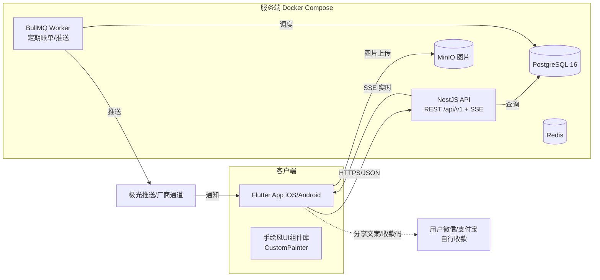

# AA分账App — 技术方案

> 版本：v1.0
> 关联文档：[产品原型 v1.0](./AA分账App-产品原型.md) ｜ [UI设计规范 v1.0](./AA分账App-UI设计规范.md)
> 技术选型（已确认）：**Flutter（客户端） + NestJS/Node.js + PostgreSQL（服务端）**

---

## 目录

1. [技术选型总览](#1-技术选型总览)
2. [系统架构](#2-系统架构)
3. [数据库设计](#3-数据库设计)
4. [API 设计](#4-api-设计)
5. [核心算法：最少转账笔数结算](#5-核心算法最少转账笔数结算)
6. [手绘风 UI 的 Flutter 落地](#6-手绘风-ui-的-flutter-落地)
7. [开发计划与排期](#7-开发计划与排期)
8. [安全与合规](#8-安全与合规)
9. [部署方案与成本](#9-部署方案与成本)
10. [风险与备选](#10-风险与备选)

---

## 1. 技术选型总览

### 1.1 客户端（Flutter）

| 维度 | 选型 | 理由 |
|---|---|---|
| 框架 | Flutter 3.x (Dart 3) | 一套代码双端；手绘动效用 CustomPainter 直接绘制，性能可控 |
| 状态管理 | Riverpod | 类型安全、可测试、无样板代码 |
| 路由 | go_router | 声明式、深链支持（邀请链接 `aafen://join/xxx` 必需） |
| 本地存储 | shared_preferences（登录态/偏好） + sqflite（离线账单缓存，可二期） | MVP 先做偏好，离线记账二期 |
| 网络 | dio + 拦截器（JWT 注入/刷新） | 成熟稳定 |
| 字体 | 站酷快乐体、龙藏体（**均免费商用**，随包内置 Asset） | 验证过许可：ZCOOL 免费商用、Long Cang 为 SIL OFL |
| 图片 | image_picker + flutter_image_compress | 凭证拍照+相册+压缩 |
| 图表 | fl_chart（定制包浆）＋手绘 CustomPainter 覆盖层 | 蜡笔柱/甜甜圈是普通图+手绘装饰层 |
| 推送 | 极光推送（JPush）国内版，或 Firebase FCM（海外） | 国内推送必须走厂商通道（小米/华为/OPPO），JPush 省事 |
| 导出 | pdf（PDF生成） + excel（syncfusion_flutter_xlsio 社区免费版）/ CSV | 满足 P53 |
| 分享 | share_plus / 系统分享，二维码 qr_flutter | P22 邀请 |
| 支付侧 | **不接入支付**，仅复制文案/收款码图片（用户支付宝/微信自理） | 规避资金合规 |

### 1.2 服务端（NestJS + PostgreSQL）

| 维度 | 选型 | 理由 |
|---|---|---|
| 框架 | NestJS 10 (TypeScript) | 模块化、DI、文档化好（装饰器） |
| ORM | Prisma | 类型安全迁移、简化 schema 管理 |
| 数据库 | PostgreSQL 16 | 金额用整数分存储、JSONB 灵活、稳定 |
| 鉴权 | JWT（access 30天 + refresh 7天） + bcrypt(12) | 账户名+密码 |
| 定时任务 | BullMQ + Redis（定期账单 daily scan） | 成熟调度 |
| 文件 | 自托管 MinIO（S3 兼容）| 小票图片，可无缝迁云 OSS |
| 实时性 | SSE（服务器推送事件，通知被动刷新） | 比 WebSocket 简单，MVP 足够 |
| API 文档 | Swagger（@nestjs/swagger 自动生成） | 前后端协作 |
| 部署 | Docker Compose（api + postgres + redis + minio + nginx/caddy） | 一台轻量服务器全搞定 |

---

## 2. 系统架构



**关键设计决策**：
- 结算算法放在**服务端**：多个客户端可能同时改"已付"状态，服务端计算保证一致
- 金额一律以**分（int）**存储与传输；展示层 Format 成 ¥xx.xx
- 定期账单由 BullMQ 每日扫描 `regular_bills.next_run_at` 生成账单副本（快照式，修改模板不影响历史）
- 图片走 MinIO 预签名 URL，账单私密性：只有参与者可读

---

## 3. 数据库设计

### 3.1 ER 关系

```
users 1─N group_members N─1 groups
groups 1─N bills
bills 1─N bill_participants N─1 users (垫付人=payer_id)
bills 1─N receipts
groups 1─N regular_bills
users 1─N notifications (含 group_id/bill_id 关联)
groups 1─N settlements (结算方案记录)
```

### 3.2 核心表

**users（用户）**

| 字段 | 类型 | 说明 |
|---|---|---|
| id | uuid PK | |
| account_name | varchar(32) **UNIQUE** | 登录账户名（昵称可重复，账户名唯一） |
| nickname | varchar(32) | 默认=账户名 |
| avatar_url | text | |
| bio | varchar(50) | |
| password_hash | varchar(100) | bcrypt(12) |
| is_placeholder | boolean，默认 false | **占位账号**标记：为「非注册成员」保留的身份锚点 |
| merged_into_user_id | uuid → users，可空 | 占位账号被**认领**后，记录合并去向 |
| security_question | varchar(50) / security_answer_hash | 找回密码 |
| created_at / updated_at | timestamptz | |

> **占位账号**：`is_placeholder = true` 的行不代表真人，它只是让「非注册成员」能出现在账单与结算里。它不可登录、不接收通知、不被用户搜索返回，其 `account_name` 使用注册规则（`^[a-zA-Z0-9_]+$`）之外的字符作前缀（如 `~guest_`），因此真人从结构上无法注册出同名账户。该设计及其取舍见 [ADR-0001](./adr/0001-占位账号承载非注册成员.md)。
>
> ⚠️ 凡「查真实账号」的查询都必须显式排除占位账号（当前已确认需要处理 `users.service.ts` 的搜索，它同时服务于「按账户名添加成员」与注册时的账户名唯一性校验）。字符前缀只能防撞名，**防不住该搜索使用的 `contains` 子串匹配**。

**groups（群组）**

| 字段 | 类型 | 说明 |
|---|---|---|
| id | uuid PK | |
| name / avatar_url / intro | | |
| owner_id | uuid → users | 群主 |
| default_split_type | enum(`even`/`custom`/`ratio`) | |
| default_exempt_user_ids | text[]，默认 `{}` | 默认免分摊人员（userId 列表，仅 active 成员） |
| invite_code | varchar(12) **UNIQUE** | 邀请码（链接/二维码） |
| created_at / deleted_at | | 软删除 |

> ⚠️ `default_exempt_user_ids` **没有外键保护**。它是纯文本数组，认领一个非注册成员时必须一并替换其中的旧 userId，否则会残留失效引用（同样无外键保护的还有 `regular_bills.participants_template`）。

**group_members（成员）**

| 字段 | 类型 | 说明 |
|---|---|---|
| id | uuid PK | |
| group_id / user_id | | 联合 UNIQUE(group_id,user_id) |
| status | enum(`active`/`left`) | 退群保留历史 |
| joined_at | | |

> `user_id` 既可以指向真实用户，也可以指向**占位账号**（即非注册成员）。字段本身无需任何改动。
>
> **成员查询口径**：`memberCount` 只计 `active` 成员（人均分母同此口径）；但群详情接口仍需返回**完整**成员列表（含 `left`），因为产品原型 P24 要求展示「已退出」状态。

**bills（账单）** ★核心

| 字段 | 类型 | 说明 |
|---|---|---|
| id | uuid PK | |
| group_id / creator_id / payer_id | uuid | 垫付人 |
| title / location | varchar | |
| amount_cents | **int** | 金额（分） |
| bill_date | date | |
| category | enum(`food`,`traffic`,`hotel`,`shopping`,`fun`,`other`) | |
| split_type | enum | 均摊/自定义/按比例/免分摊 |
| settle_status | enum(`pending`,`partial`,`settled`) | 派生字段，服务端维护 |
| is_regular / regular_id | bool / uuid | 是否定期账单生成的 |
| created_at / deleted_at | | |

**bill_participants（分摊明细）**

| 字段 | 类型 | 说明 |
|---|---|---|
| id | uuid PK | |
| bill_id / user_id | | 联合 UNIQUE |
| share_amount_cents | int | 应摊 |
| exempt | bool | 免摊（请客） |
| paid | bool / paid_at | 已付 |
| remind_count | int | 已催次数 |

> ⚠️ **校验约束**：`sum(share_amount_cents) = amount_cents`（服务端事务内校验，免摊者=0）

**receipts（凭证）**：id、bill_id、object_key、sort
**notifications（通知）**：id、user_id、type(`new_bill`/`remind`/`invite`/`regular`/`settled`)、title、body、ref_type/ref_id、is_read、created_at
**regular_bills（定期账单）**：id、group_id、creator_id、title、amount_cents、category、split_type、cycle(`weekly`/`biweekly`/`monthly`)、day_of_week/day_of_month、next_run_at、active
**settlements（结算记录）**：id、group_id、from_user_id、to_user_id、amount_cents、status(`pending`/`paid`)、created_at

### 3.3 关键索引

- `bill_participants(bill_id)`、`bills(group_id, bill_date DESC)`、`notifications(user_id, is_read)`
- `groups.invite_code` 唯一索引（深链查找）
- 金额字段使用 `CHECK (amount_cents >= 0)`

### 3.4 认领合并：占位账号 → 真实账号 的迁移步骤

「认领」是把一个非注册成员（占位账号）的全部历史归到一个真实账号名下。以下步骤**必须在单个事务内完成**，任一步失败整体回滚。

记 `P` = 占位账号 userId，`T` = 目标真实账号 userId，`G` = 群组 id。

**前置校验（不满足则拒绝）**

```sql
SELECT id, is_placeholder, merged_into_user_id FROM users WHERE id IN (P, T);
-- 要求：P.is_placeholder = true 且 P.merged_into_user_id IS NULL（未被认领过）
--       T.is_placeholder = false（目标必须是真实账号）
```

**① 群成员关系（必然冲突：T 可能已在群内）**

```sql
-- T 已在群内：删除 P 的成员行，加入时间取两者更早的
UPDATE group_members SET joined_at = LEAST(joined_at, <P 原 joined_at>)
 WHERE group_id = G AND user_id = T;
DELETE FROM group_members WHERE group_id = G AND user_id = P;

-- T 不在群内：把 P 的成员行直接改挂到 T（即自动入群）
UPDATE group_members SET user_id = T WHERE group_id = G AND user_id = P;
```

**② 账单参与人（必然冲突：`UNIQUE(bill_id, user_id)`）**

```sql
-- 先合并冲突行：同一账单里 P、T 各有份额
UPDATE bill_participants tp
   SET share_amount_cents = tp.share_amount_cents + pp.share_amount_cents,
       paid    = tp.paid   AND pp.paid,
       exempt  = tp.exempt AND pp.exempt,
       paid_at = CASE WHEN tp.paid AND pp.paid
                      THEN COALESCE(tp.paid_at, pp.paid_at) END
  FROM bill_participants pp
 WHERE pp.user_id = P AND tp.user_id = T AND tp.bill_id = pp.bill_id;

-- 再改挂剩余的无冲突行
UPDATE bill_participants SET user_id = T WHERE user_id = P;
```

> 份额相加是唯一能保持 `sum(share_amount_cents) = amount_cents` 的做法，**不可丢弃任一行**。
> `paid` 取「两行都已付」、`exempt` 取「两行都已免」，是不偏袒欠款方的保守口径。

**③ 垫付人**

```sql
UPDATE bills SET payer_id = T WHERE payer_id = P;
```

> `bills.creator_id` 无需处理：创建账单必须登录，占位账号不可能成为创建者。

**④ 结算记录（含已结清历史）**

```sql
UPDATE settlements SET from_user_id = T WHERE from_user_id = P;
UPDATE settlements SET to_user_id   = T WHERE to_user_id   = P;
-- 该群 pending 方案是派生数据（getSettlement 每次先删后重建），直接清掉即可
DELETE FROM settlements WHERE group_id = G AND status = 'pending';
```

**⑤ 免分摊名单（`TEXT[]`，无外键保护，最易漏）**

```sql
UPDATE groups
   SET default_exempt_user_ids = (
     SELECT ARRAY(SELECT DISTINCT unnest(array_replace(default_exempt_user_ids, P, T)))
   )
 WHERE id = G AND P = ANY(default_exempt_user_ids);
```

**⑥ 定期账单模板（`JSON`，无外键保护，最易漏）**

`regular_bills.participants_template` 是 JSON，无法用纯 SQL 可靠处理：逐行读出，在应用层把 `userId = P` 替换为 `T`；若替换后同一模板内出现重复 `userId`，则 `shareAmountCents` 相加、`exempt` 取 AND，再写回。

**⑦ 占位账号行本身**

```sql
UPDATE users SET deleted_at = now(), merged_into_user_id = T WHERE id = P;
```

> **保留该行、不删除**。迁移是手写 SQL，一旦漏掉某处引用，保留行可避免外键悬空，同时留下可追溯的合并去向。
> 认领是否已执行过：`users.merged_into_user_id IS NOT NULL` 即为已认领，接口应拒绝重复认领。

**不需要迁移的位置**：`user_devices`、`notifications`、`receipt_uploads`、`bills.creator_id`、`regular_bills.creator_id` —— 占位账号无登录设备、不接收通知、不上传凭证、也不能创建账单或定期账单。

---

## 4. API 设计

- 前缀 `/api/v1`，JSON 响应统一 `{ code: 0, message: "ok", data: ... }`（非0为业务错误码）
- 鉴权：`Authorization: Bearer <JWT>`；分页 `?page=1&pageSize=20`
- Swagger 自动文档：`/api/docs`

### 4.1 认证

| 方法 | 路径 | 说明 |
|---|---|---|
| POST | /auth/register | `{accountName,password,nickname?,securityQuestion,securityAnswer}` |
| POST | /auth/login | `{accountName,password}` → `{accessToken,user}` |
| POST | /auth/forgot/verify | 安全问题验证 → `{resetToken}`（10分钟有效） |
| POST | /auth/forgot/reset | `{resetToken,newPassword}` |
| POST | /auth/change-password | 当前密码+新密码 |
| GET | /auth/me | 我的资料 |

### 4.2 群组

| 方法 | 路径 | 说明 |
|---|---|---|
| GET/POST | /groups | 列表 / 创建 |
| GET/PATCH/DELETE | /groups/:id | 详情/修改/解散（仅群主） |
| POST | /groups/:id/members | 添加成员（按账户名搜索，**仅能添加已注册用户**；任一在群成员可调用） |
| DELETE | /groups/:id/members/:userId | 移除 |
| POST | /groups/:id/placeholder-members | **仅群主**：添加非注册成员，`{displayName}` |
| PATCH | /groups/:id/placeholder-members/:userId | **仅群主**：修改非注册成员名称 |
| GET | /groups/:id/placeholder-members/:userId/claim-preview?targetUserId= | **仅群主**：认领前预览（只读）→ `{billCount, settlementCount, placeholderName, targetName, targetInGroup}` |
| POST | /groups/:id/placeholder-members/:userId/claim | **仅群主**：认领，`{targetUserId}` |
| POST | /groups/:id/transfer | 转让群主 |
| POST | /groups/join | `{inviteCode}` 加入 |
| GET | /groups/:id/invite | 邀请码+二维码 |

> **新增非注册成员接口的校验规则**：仅群主可调用；`displayName` 长度 1–32、服务端 `trim` 并去除换行与控制字符；名称需与群内全体成员的显示名比对（**含已退出成员**），重名则报错；单群上限 50 人。
>
> **认领应用层额外约定**：
> - 客户端「绑定到账户」的目标**只列本群注册成员**（含已退出）—— 认领不可撤销，避免手打账户名认错人；服务端仍接受任意真实账号（不在群内则自动入群）。
> - 重复认领（`users.merged_into_user_id IS NOT NULL`）返回 409，不是 404：认领后群成员行可能已被删除，但占位账号行保留，必须能被识别为「已认领」。
> - **非注册成员不能成为群主**：`POST /groups/:id/transfer` 对占位账号返回 400；`DELETE /auth/me`（注销）的所有者自动转移也会跳过占位账号，群内没有其他真实成员时落到软删除。占位账号无法登录，转让后群会无人可管理。
> - **注册实时唯一性校验**改用 `GET /users/account-available?accountName=`（公开、**精确匹配**、排除占位账号）。此前客户端复用 `/users/search` 的 `contains` 模糊搜索，导致「已有 `zhangsan` 时想注册 `zhang` 会误报已被占用」，且该接口需登录（注册流程尚未登录，实际永远放行）。
>
> ⚠️ `docs/api-endpoints.generated.md` 由 `scripts/sync-docs.mjs` 扫描控制器自动生成、**不可手改**，上述端点会随下一次 `docs-sync.yml` 自动出现（本轮已本地重新生成）。

### 4.3 账单

| 方法 | 路径 | 说明 |
|---|---|---|
| GET | /groups/:id/bills | 群账单流水 |
| POST | /bills | 创建（含participants[]，服务端校验分摊合计） |
| GET/PATCH/DELETE | /bills/:id | 详情/编辑/删除（创建者或群主） |
| POST | /bills/:id/receipts | 上传凭证（multipart） |
| POST | /bills/:id/mark-paid | `{userId,paid:true}` 标记已付 |
| POST | /bills/:id/remind | `{userIds[],message}` 催款（写通知） |

### 4.4 结算

| 方法 | 路径 | 说明 |
|---|---|---|
| GET | /groups/:id/settlement | 计算最少转账方案（算法见§5），返回 `[{from,to,amountCents,billIds}]` |
| POST | /settlements/:id/paid | 标记某笔转账已完成（状态跟踪） |

### 4.5 其他

| 方法 | 路径 | 说明 |
|---|---|---|
| GET | /notifications?type= | 消息列表 + 已读 |
| POST | /notifications/read-all | |
| GET/POST/PATCH/DELETE | /regular-bills | 定期账单管理 |
| GET | /me/export?format=xlsx | 导出（异步任务→下载URL） |
| GET | /me/statistics?year= | 统计（柱状/分类聚合，或客户端本地算） |

### 4.6 示例：注册

```jsonc
POST /api/v1/auth/register
{
  "accountName": "tuanzi_t",
  "password": "abc123ABC",
  "nickname": "团子酱",
  "securityQuestion": "你第一个朋友的名字？",
  "securityAnswer": "小虎"
}
// 200
{ "code": 0, "message": "ok",
  "data": { "accessToken": "eyJ...", "user": { "id": "...", "accountName": "tuanzi_t", "nickname": "团子酱" } } }
```

### 4.7 示例：结算方案

```jsonc
GET /api/v1/groups/{id}/settlement
{ "code": 0, "data": {
  "transferCount": 3,
  "transfers": [
    { "fromUserId": "wangwu", "toUserId": "me", "amountCents": 8650, "billIds": ["b1"] },
    { "fromUserId": "zhangsan", "toUserId": "me", "amountCents": 5500, "billIds": ["b1"] },
    { "fromUserId": "me", "toUserId": "lisi", "amountCents": 12000, "billIds": ["b2"] }
  ]
} }
```

---

## 5. 核心算法：最少转账笔数结算

**目标**：给定群组内所有未结清账单的参与者应摊金额，求一组转账 `(from, to, amount)`，使所有成员账户清零且**转账笔数最少**。

**步骤**（贪心配对，业界标准做法）：

```
1. 对每个成员 u 计算净值：
   net[u] = Σ(别人给我的已付垫付份额) - Σ(我应摊的份额)   // 以"我承担的钱"为基准
   即 net[u] = payee[u] - owe[u]
   （payer_id 用户相当于先把钱垫出来，净值为正=应收，负=应付）

2. 忽略 net ≈ 0 的成员（±0.01 内阈值，避免浮点误差——金额全部用分，无双精度问题）

3. 把 members 按净值排序：creditors 降序（正）、debtors 升序（负）

4. 双向指针贪心配对：
   while debtors 与 creditors 都不空:
      d = 最大债务（net 最小）; c = 最大债主（net 最大）
      t = min(|d|, c)
      生成转账: d → c, 金额 t
      更新两者净值; 清零者出列
      （t = 0 的边界：直接跳过；若 d、c 同群成员跳过自己）

5. 输出 transfers 列表（服务端按金额从大到小排序展示）
```

**为什么贪心是最优**：每笔转账至少清零一方（取 min），当债务/债权数值互不相加时笔数最少；该算法复杂度 O(n log n)，n=群成员数（常见 ≤ 20），无性能问题。

**"逐笔结算"模式**：按账单逐条生成 `payer → 每位参与人` 的明细（不合并），供小规模群查看。

**一致性**：任何成员标记"已付"→ 事务内更新 `paid` → `settle_status` 重算 → 结算方案下次查询自动变化；不接受"先算什么算什么"的缓存。

---

## 6. 手绘风 UI 的 Flutter 落地

| 设计规范 | Flutter 实现 |
|---|---|
| 手抖描边（不规则圆角） | 自定义 `SketchyBorder extends ShapeBorder`：Path 用 Q 曲线生成 4 条轻微弯曲边 + 随机种子固定（同参同形），到处复用 |
| 卡片/胶带/印章 | 封装 `PaperCard`、`TapeDecorator`、`StampBadge` 组件库（`packages/aa_design`） |
| 手写字体 | 字体 asset 引入 pubspec：`ZCOOL-KuaiLe`（标题）、`LongCang`（金额）；主题 `TextTheme` 全局绑定，金额组件 `HandAmount` 用 LongCang |
| 手绘下划线/划重点 | 下划线：CustomPainter 画弯曲贝塞尔线；高亮：Container 叠 `linear-gradient(transparent 55%, #FFE8A3 55%)` |
| 涂鸦图标 | 现成 icon 转 SVG → `flutter_svg`；核心图标（房子/人像组/铅笔/铃铛）手工 SVG 路径 |
| 动效（§8.1 规范） | `AnimationController` + 关键帧曲线 `CubicBezierCurve`；描边动画 = `PathMetric.extractPath`（对勾/箭头）；纸飞机/金币 = 自定义 `Transform.translate` + `rotate` 多关键帧 + 虚线轨迹 `drawPath`（`dashArray`），全部封装在 `DoodleAnimations` 类 |
| 网格纸背景 | `CustomPainter` 循环画点阵（间距24，5%墨色），低成本 |
| 主题令牌 | `AATokens`（颜色/间距/边框宽度/阴影偏移）对应设计规范色板，暗色模式同一套 token 换背景 |
| 深链 | go_router `aafen://join/{code}`：未登录→登录后回跳→确认加入 |

---

## 7. 开发计划与排期

> 单人全职开发，约 **12 周**；如两人并行（客户端/服务端）可压缩至 8 周。

| 阶段 | 内容 | 周期 | 里程碑/验收 |
|---|---|---|---|
| M0 搭建 | 仓库初始化（monorepo：app+server+docs）、Docker Compose 环境、CI（GitHub Actions 双端打包）、设计令牌与字体 asset 落地 | 1周 | ✅ App 能跑空壳，API 健康检查通 |
| M1 账户 | 注册/登录/JWT/安全问题找回/改密；Flutter 登录注册 4 页 + 启动页 | 2周 | ✅ 全流程走通（原型 A 层） |
| M2 群组 | 群组 CRUD/邀请（链接+二维码+账户名）/成员管理/搜索 | 2周 | ✅ 建群拉人闭环（原型 D 层除结算） |
| M3 记账 | 账单 CRUD/四种分摊/选择参与人/凭证拍照上传/账单详情 | 3周 | ✅ 记一笔30秒（原型 E 层+ P14） |
| M4 结算 | 最少转账算法（服务端+单测）/结算页/催款/标记已付/通知（SSE+推送） | 2周 | ✅ 结算清账闭环（原型 P25/P26/P40） |
| M5 收尾 | 定期账单/BullMQ 调度/统计页/数据导出/设置与账号安全/关于页 | 2周 | ✅ 原型 P13/P34/P52/P53 等全量 |
| M6 上线 | 打磨动效/空状态、真机测试（iOS/Android 各 3 台）、性能与弱网、应用商店上架 | 2周 | ✅ 双端上架，灰度 100 人 |

**验收基线**：原型 31 页全部可达；核心链路（注册→建群→记账→结算→催款→已付）端到端自动化测试通过。

---

## 8. 安全与合规

- **密码**：bcrypt(12) 哈希，绝不明文/可逆存储；登录限流（同账户5次失败锁定10分钟）
- **JWT**：access 30天（移动端自然）+ 设备管理可吊销；敏感操作（改密/安全问题）需当前密码
- **传输**：全站 HTTPS（Let's Encrypt 自动续期）；图片预签名 URL 短时效
- **数据权限**：账单仅参与者/群主可读；未加入群组一律 404 伪装（防探测）
- **审计**：关键操作（删除账单/解散群组）落操作日志
- **合规声明**：App 不托管资金、不代收代付——用户间转账走微信/支付宝自有功能，故无需支付牌照；《用户协议》《隐私政策》明确"财务行为由用户自担"；提供「删除我的数据」（P27/P52 入口，30天内物理删除）
- **图标/字体版权**：站酷快乐体、龙藏体均为免费商用许可，已核实；吉祥物"团团"为原创，建议做版权登记（可选）

---

## 9. 部署方案与成本

| 项目 | 方案 | 月成本估算 |
|---|---|---|
| 云服务器 | 腾讯云/阿里云轻量 2C4G（香港或国内，域名需备案） | ¥60-100/月 |
| PostgreSQL/Redis/MinIO | 同机 Docker Compose（数据库与容器自动备份每日快照到 OSS） | 0 |
| 域名 | .com/.cn 年付 | ¥60-80/年 |
| SSL | Let's Encrypt 免费 | 0 |
| 推送 | 极光基础版（万级用户免费档） | 0（初始） |
| iOS 开发者账号 | Apple | $99/年 |
| 合计 | | **首年 ≈ ¥1,500-2,000** |

**弹性**：用户量突破 1 万后再拆库/上云（ECS+PgSQL云版），架构上已按可迁移设计（MinIO→OSS、SSE→WebSocket 集群）。

---

## 10. 风险与备选

| 风险 | 等级 | 对策 |
|---|---|---|
| 应用商店审核（"收钱"敏感） | 中 | 界面/文案强调"仅记账提醒，资金走微信/支付宝"；准备好免责与隐私政策 |
| 手绘字体渲染差异 | 低 | 字体随包内置（不打网络加载），双端一致；低端机降级系统楷体 |
| 国内推送到达率 | 中 | 优先厂商通道（JPush 聚合），App 内消息中心兜底 |
| 多端并发标记已付 | 低 | 服务端事务 + 版本号乐观锁 |
| 定期账单时区/翻月 | 低 | 统一 Asia/Shanghai 计算 next_run_at，月结日 29-31 号自动顺延（取当月最后一天） |

---

*技术方案 v1.0 · 下一步：M0 环境搭建（仓库初始化 + Docker 环境 + 设计令牌落地）*
